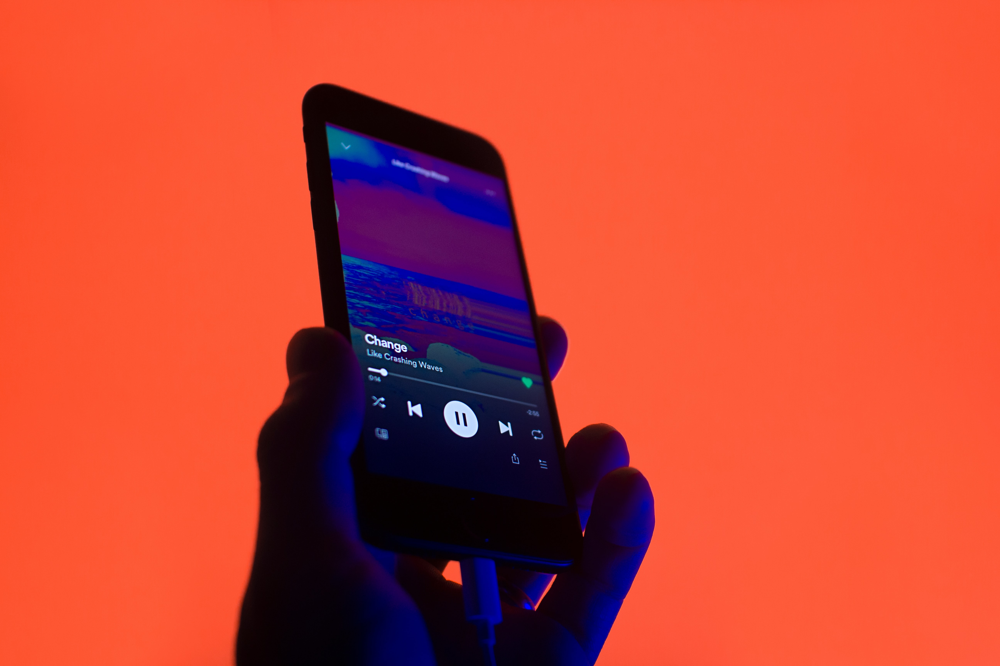

# An AI guide into Afrobeats

---

---

## Problem Statement
The popularity of afrobeats has increases tremendously as a result of social media. An increase in popularity also increased the variety in its genre. Finding the right sound for someone new to afrobeats might be challenging.

I am attempting to create a recommendation system that will generate an Afrobeats playlist based on your favourite playlist.

---
## DATA

I am using the spotipy program to fetch the songs from the [Spotify](https://developer.spotify.com/documentation/web-api/quick-start/) API.

The [Spotify](https://developer.spotify.com/documentation/web-api/quick-start/) API gives a lot of useful track features, such as danceability, acoustics etc. Explanations of the different features are done in the methodology below.

---
## Methodology
#### Data Gathering

#### Data Cleaning

#### EDA

#### Feature Engineering

#### Modeling

#### Charts

---
## Conclusion

---
## Recommendations and Next Steps